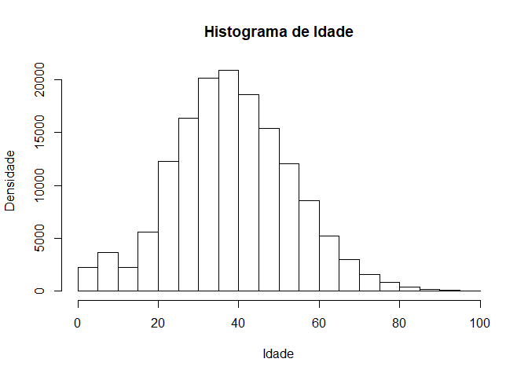

Projeto Integrador em Ciências de Dados e Inteligência Artificial - II B
================
Gean Machado
19/06/2021

Base de dados adotada:
<https://s3-sa-east-1.amazonaws.com/ckan.saude.gov.br/dados-pr-1.csv>

### Introdução

A base de dados registra informações sobre os dados epidemiológicos de
Síndrome Gripal (SG), oriundas a partir da incorporação do sistema
“e-SUS VE Notifica”, desenvolvido para o registro de casos suspeitos de
COVID-19. O conjunto de dados selecionados restringe ao volume 1 dos
dados coletados no Estado do Paraná.

### Objetivos

O objetivo é fazer uma análise exploratória dos dados, através da
analise grupos catalogados, avaliação das amplitudes dos dados coletados
e visualização do comportamento dos dados através das ferramentas
gráficas significativas com as variáveis disponíveis.

### Analise exploratoria de dados.

Para facilitar o processo de importação dos dados da planilha no formato
.CSV, escolhe-se a fonte de dados direto do diretório.

``` r
library(dplyr)
dados <- read.csv("dados-pr-1.csv", header = TRUE , sep = ';')
```

Filtram-se as variáveis de interesse.

``` r
excluir <- c(1,2,3,4,5,6,7,8,13,15,16,17,18,19,20,22,24,25,26,30)
dados<-dados[,-excluir]
head(dados)
```

    ##   estadoTeste                dataTeste                tipoTeste resultadoTeste
    ## 1   Concluído 2020-06-04T00:00:00.000Z TESTE RÁPIDO - ANTICORPO       Negativo
    ## 2   Concluído 2020-06-04T00:00:00.000Z TESTE RÁPIDO - ANTICORPO       Negativo
    ## 3   Concluído 2020-06-04T00:00:00.000Z TESTE RÁPIDO - ANTICORPO       Negativo
    ## 4   Concluído 2020-06-04T00:00:00.000Z TESTE RÁPIDO - ANTICORPO       Negativo
    ## 5   Concluído 2020-06-04T00:00:00.000Z TESTE RÁPIDO - ANTICORPO       Negativo
    ## 6   Concluído 2020-06-04T00:00:00.000Z TESTE RÁPIDO - ANTICORPO       Negativo
    ##        sexo estadoNotificacao municipioNotificacao idade dataEncerramento
    ## 1 Masculino            PARANÁ             Curitiba    42                 
    ## 2  Feminino            PARANÁ             Curitiba    46                 
    ## 3  Feminino            PARANÁ             Curitiba    33                 
    ## 4  Feminino            PARANÁ             Curitiba    40                 
    ## 5  Feminino            PARANÁ             Curitiba    40                 
    ## 6  Feminino            PARANÁ             Curitiba    35                 
    ##   evolucaoCaso
    ## 1             
    ## 2             
    ## 3             
    ## 4             
    ## 5             
    ## 6

### Contexto da análise exploratoria

Os nomes de cada coluna indicam o tipo de observação catalogada são
elas: estadoTeste, dataTeste, tipoTeste, resultadoTeste, sexo,
estadoNotificacao, municipioNotificacao, idade, dataEncerramento,
evolucaoCaso.

A base de dados tem muitos valores vazios ou preenchidos com a palavra
*null*, para melhor manipular as observações, identificam-se esses
valores por atribuição de `NA` e, ao fim, removem-se as linhas que
contém essa característica.

``` r
dados[dados==""]<- NA
dados[dados=="null"]<- NA
dados <- na.omit(dados)
```

A quantidade de observações reduz bastante, porém facilita as próximas
análises.

#### Variável: estadoTeste

``` r
unique(dados$estadoTeste)
```

    ## [1] Concluído
    ## Levels:  Coletado Concluído Exame Não Solicitado null Solicitado

A *estadoTeste* indica a fase do acompanhamento realizado. Com interesse
em trabalhar apenas com os casos *Concluído*, será possível analisar a
quantia de 149299 observações.

#### Variável: tipoTeste

Os teste se dividem em três grupos, *Molecular* sendo os PCR(proteína
C-reativa), *Imunológico* que são os sorológicos e os *Testes rápidos*.

Abaixo, segue a tabela de frequência dos tipos de testes:

``` r
table(dados$tipoTest)
```

#### Variável: dataTeste e dataEncerramento

A coluna *dataTeste* indica que o registro mais antigo é de
1970-01-01T00:00:00.000Z o que sugere que a base está mal preenchida,
conferindo as duas colunas (*dataTeste* e *dataEncerramento*) que tem
informações da data, temos as seguintes observações:

``` r
library(lubridate)
as.Date(dados$dataTeste)
as.Date(dados$dataEncerramento)

unique(year(dados$dataTeste))
unique(year(dados$dataEncerramento))
```

Ressalta-se que existe ocorrência de teste realizado no ano de
1970/2000/2002 na coluna *dataTeste*; e 2002/2019/2011/2010 ,na coluna
*dataEncerramento*. Na coluna da data do teste, possivelmente, foi
preenchido incorretamente ano de nascimento no lugar da data do teste.
Já para a data de encerramento, é provável que tenham ocorridos erros de
digitação, visto que o acompanhamento dos casos de Covid-19 ocorreu no
início do ano de 2020. Para filtrar melhor os dados e evitar *outliers*,
retiram-se esses valores.

``` r
dados <- dados[!year(dados$dataTeste)=="1970",]
dados <- dados[!year(dados$dataTeste)=="2000",]
dados <- dados[!year(dados$dataTeste)=="2002",]
```

O mesmo para o registro do encerramento do acompanhamento.

``` r
dados <- dados[!year(dados$dataEncerramento)=="2002",]
dados <- dados[!year(dados$dataEncerramento)=="2019",]
dados <- dados[!year(dados$dataEncerramento)=="2011",]
dados <- dados[!year(dados$dataEncerramento)=="2010",]
unique(year(dados$dataTeste))
```

    ## [1] 2020 2021

``` r
unique(year(dados$dataEncerramento))
```

    ## [1] 2020 2021

Feitos esses ajuste, é possível identificar que o registro mais antigo
nos registro de acompanhamento é de 2020-02-10T03:00:00.000Z sendo o
último em 2021-01-23T03:00:00.000Z. Fica fácil de visualizar a
frequência acumulada pelo gráfico a seguir:

``` r
barplot(table(year(dados$dataTeste)),
        xlab = "Ano",
        ylab = "Qtd",
        main = "Casos de acompanhamento 'Concluído'")
```

<!-- -->

#### Variável: estadoNotificacao

Pela coluna *estadoNotificacao* é possivel visualizar a origem dos
individuos dos quais se fez acompanhamento no estado do Paraná.

Usando uma ferramenta de construção de mapas simples no R, com a
biblioteca `rgdal`, com recursos gráficos para *shapes* e de forma
gratuita disponibilizado pelo IBGE, é possível visualizar que na amostra
de dados consta acompanhamento para pessoas oriundas de todo o País, com
predominância de dados para o estado do Paraná com 147250 observações.

``` r
library(rgdal)
shp <- readOGR("Mapa\\.", "BR_UF_2020", stringsAsFactors=FALSE, encoding="UTF-8")
```

    ## OGR data source with driver: ESRI Shapefile 
    ## Source: "C:\Users\geans\Documents\R\Mapa", layer: "BR_UF_2020"
    ## with 27 features
    ## It has 4 fields

``` r
estados<-table(dados$estadoNotificacao)
estados<-data.frame(estados)
estados[estados==""]<- NA
estados <- na.omit(estados)
ibge <- read.csv("Mapa\\BR_UF_2020.csv", header=T,sep=";")
ibge$estados <- estados$Var1
pg <- merge(estados,ibge, by.x = "Var1", by.y = "estados")
brasileiropg <- merge(shp,pg, by.x = "CD_UF", by.y = "CD_UF.C.2")

proj4string(brasileiropg) <- CRS("+proj=longlat +datum=WGS84 +no_defs")

Encoding(brasileiropg$NM_UF) <- "UTF-8"

brasileiropg$Score[is.na(brasileiropg$Freq)] <- 0
library(leaflet)
pal <- colorBin("Blues",domain = NULL,n=5) #cores do mapa

state_popup <- paste0("<strong>Estado: </strong>", 
                      brasileiropg$Var1, 
                      "<br><strong>Casos Confirmados: </strong>", 
                      brasileiropg$Freq)
leaflet(data = brasileiropg) %>%
  addProviderTiles("CartoDB.Positron") %>%
    addPolygons(fillColor = ~pal(brasileiropg$Freq), 
              fillOpacity = 0.8, 
              color = "#BDBDC3", 
              weight = 1, 
              popup = state_popup) %>%
    addLegend("bottomright", pal = pal, values = ~brasileiropg$Freq,
            title = "Origem da pessoas acompanhadas",
            opacity = 1)
```

<!-- -->

#### Variável: idade e sexo

Ainda existe mais divergência nos dados amostrado no banco de dados, nos
valores indicado no campo idade, tendo um intervalo de 0 a 5980, o que
não é possível no mundo real.

Para fins de conformidade, adota-se como idade máxima 100 anos.
Agrupam-se os gêneros e esses são relacionados à idade para visualizar
graficamente por meio da função `boxplot()` as características como
mediana, amplitude de idades máximas e mínimas e ainda representada por
quartis.

``` r
dados <- dados[dados$idade <=101,]
tabela <- dados[,c("sexo","idade")]
boxplot(idade ~ sexo, data = tabela)
```

<!-- -->

Ainda sobre a variável *idade*, é possível observar que os valores
amostrados têm uma distribuição similar à distribuição normal.

``` r
hist(dados$idade, xlab = "Idade", ylab = "Densidade", main = "Histograma de Idade")
```

<!-- -->

## Conclusão

A base de dados traz um número significativo de registros, embora boa
parte da integridade das observações fique comprometida devido à falta
de rigor quanto ao preenchimento e à omissão das variáveis. O que pode
criar barreiras e dificuldades para a análise correta de correlações e
inferências.

A observação dos dados exibidos até aqui, possibilita uma prévia
compreensão do comportamento dos casos de COVID-19 no Estado do Paraná
no período observado. Essa análise descritiva é importante no que diz
respeito aos estudos científico e à análise estatística com fins de
tomada de decisões.
